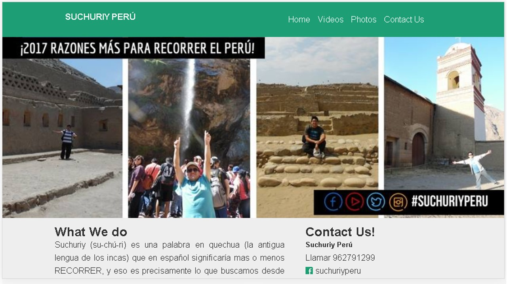
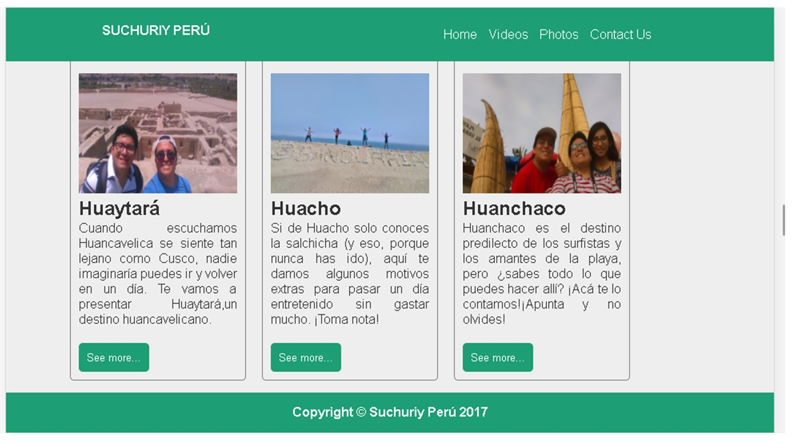
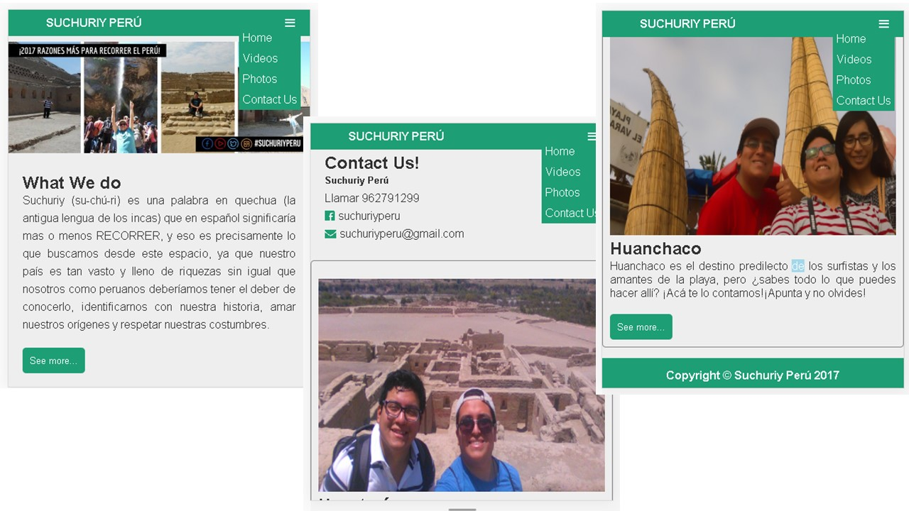

# Proyecto:Suchuriy Perú
_____________

## Descripción del proyecto
El siguiente proyecto es una propuesta de mejora a la página web del blog de viaje SUCHURIY PERÚ.
La actual página esta desarrollada en wordpress y se encuentra en la siguiente dirección: https://suchuriyperu.wordpress.com/

La propuesta está estructurada con un diseño de grillas de 12 columnas en CSS para que se encuentre bajo los lineamientos del responsive design y sea adapatable a cada dispositivo en que se realice.
## Vistas desktop
Estas son las vistas para dispositivos con resoluciones mayores o iguales a 768px.

## Vistas mobile
Estas son las vistas para dispositivos con resoluciones menores a 768px.

## Detalles adicionales
-Para esta aplicación se empleó : HTML5, CSS3 y Javascript.

  
  Cualquier consulta, duda o sugerencia puede realizarla al correo: adayc@hotmail.com
